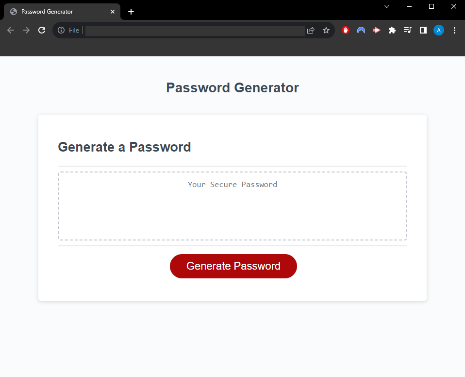

# Random-Password-Generator

## Description

This application will generate a random password based on user input on varied prompts.

## Usage

1. Open the application in a web brower.
2. Upon clicking the 'Generate Password' button, you will be presented with the option to choose a numerical password length between 8 and 128 characters.  If you choose a value outside of this range, you will be prompted to enter a value within the specified range and the prompt will reset.  If you cancel the prompt, the alert "Cancelled" will display and the function will end.
3. You will then be advised that you have four character choices to include in the password, of which at least one option MUST be selected in order to generate a valid password.  If no selections are made an invalid result will display.
4. Via separate consecutive prompts, you will be asked if you would like to include lowercase, uppercase, numbers and special characters respectively.
5. Based on your chosen criteria, a random password will be generated of the selected length and displayed in the box.

## Credits

This application was created via source code (index.html, style.css and script.js) received from the University of North Carolina: Chapel Hill Coding Bootcamp syllabus.  Only the script.js file has been modified with code added to enable a functioning application.

Assistance with developing code and debugging was obtained from:

Vega, D. (2020) Random Password Generator in JavaScript.
https://www.youtube.com/watch?v=v2jfGo7ztm8&ab_channel=DanielVega

## Application Link

